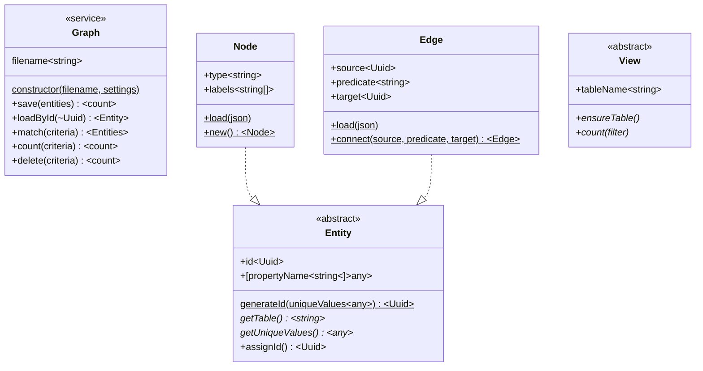

# Simple Graph Object/DB Schema

Under the hood, the DB model has two simple tables: `node` and `edge`. Nodes are self-contained, while edges describe a directed relationship between two nodes. Both tables have a single key column: `data`, which stores a blob of JSON. That JSON, in turn, is just the serialized version of a Node or Edge JSON object; this reduces the ORM work to "babysitting `JSON.parse()` and `JSON.stringify()` Additional database columns (`node.id`, `node.type`; `edge.source`, `edge.predicate`, and `edge.target`) are generated based on parsed elements of the `data` column. Filters, sorts, and reporting queries can use Sqlite's JSON functions to pull deep properties from the `data` column's JSON bag.

